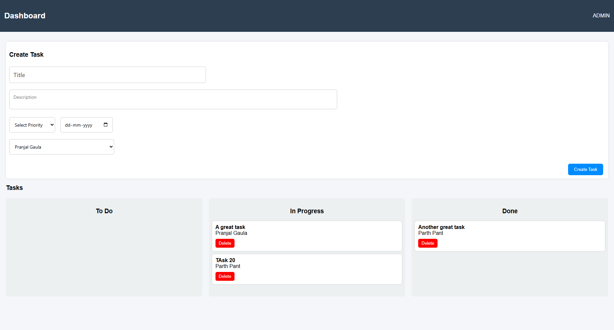

# Problem Statement
The current systems are not seamless when it comes to collaborative tasks and this is seen as an additional feature. Thus there is a lack of dedicated collaborative systems for companies and organizations.

# Prerequisites
- Before accessing the project, make sure:
* You have xampp installed and apache and mysql running in the xampp control panel.
* You have the project inside the /xampp/htdocs/ folder. (Usually C:/xampp/htdocs).

# Smart-Workflow-and-Collaboration
* This is an web application implementing a system that is designed to simplify collaboration over the internet.
* It is a dedicated interface that is implementable in various organizations and companies with a hierarchical structure that involves teams that work individually on various projects.
    * It can be used to assign different parts of a task/project to different team members
    **OR**
    * It can be used to assign different tasks/projects to different teams as well.

# Execution Process
1. Start apache and mysql from the xampp control panel.
2. Open the link to phpMyAdmin (http://localhost/phpmyadmin/) and create a new database. 
3. Edit the backend/config/db.php file and replace [password] with mySQL root password and [database_name] with the name of the newly created database.
4. Run the following query inside the database in phpMyAdmin page:
    CREATE TABLE users (
        id INT AUTO_INCREMENT PRIMARY KEY,
        name VARCHAR(100) NOT NULL,
        password VARCHAR(255) NOT NULL,
        role ENUM('admin', 'member') DEFAULT 'member'
    );
    CREATE TABLE tasks (
        id INT AUTO_INCREMENT PRIMARY KEY,
        title VARCHAR(255) NOT NULL,
        description TEXT,
        status ENUM('todo', 'in_progress', 'done') DEFAULT 'todo',
        priority ENUM('low', 'medium', 'high') DEFAULT 'medium',
        deadline DATE,
        assigned_to INT,

        FOREIGN KEY (assigned_to) REFERENCES users(id)
            ON DELETE CASCADE
    );
    - This will create the tables' structures.
5. Open the index.html page in the localhost server (http://localhost/smartworkflow/frontend/index.html). 
6. Now add users using the register page and start working with it.

# Screenshots

